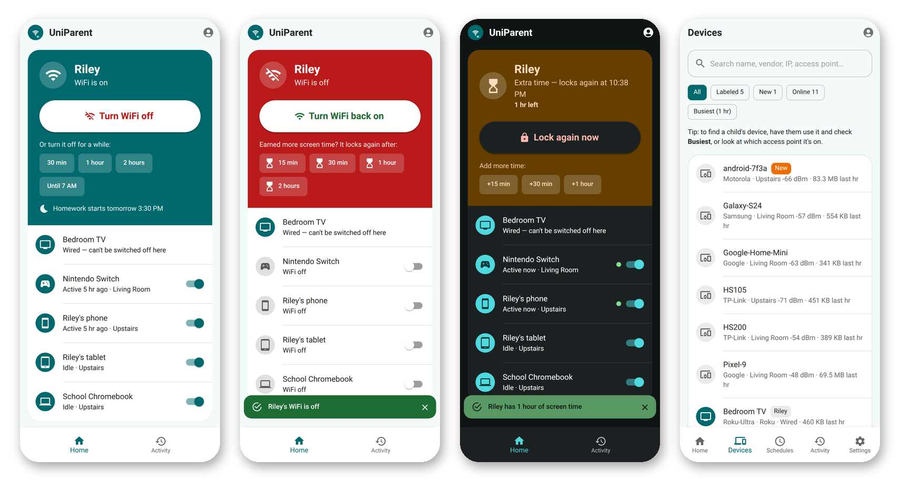
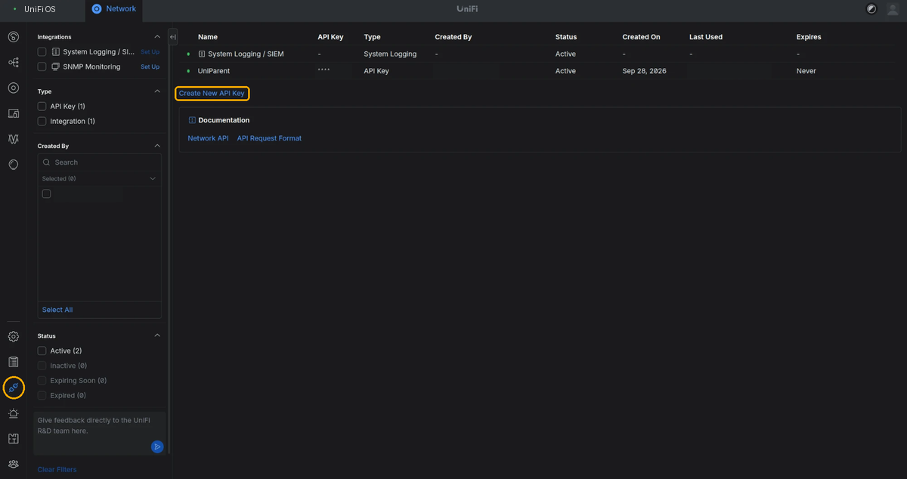

# UniParent



**A simple phone app for turning your kids' WiFi off and on — all their devices at once, or one at a time — on a network run by a UniFi controller.**

Parents get one big button per child, quick "off for an hour" or "until morning" pauses, **extra screen time that locks again by itself**, and a per-device switch. An admin can find and label each device, group them by child, set bedtime and homework schedules, and see who did what in an activity log.

UniParent runs as a small web app on your home server and installs on Android (and iPhone) like a regular app.

## What it does

- **One button per child** turns WiFi off for every device in their group, and back on.
- **Pauses**: 30 min, 1 hour, 2 hours or until 7 AM; WiFi comes back by itself.
- **Extra screen time**: dinner and chores done? Give 15 min, 30 min, 1 hour or 2 hours while WiFi is off — during a pause or even a bedtime schedule — and it locks again by itself when the time is up. Tap again to add more, or *Lock again now* to end it early. Works for the whole group or a single device.
- **Per-device switches**, including letting one device back on (say, the school laptop) while the rest stay off.
- **Schedules** such as *Bedtime, school nights 9 PM – 7 AM*. Tapping *Turn WiFi back on* during a schedule skips just that one.
- **Activity**: see which devices are in use right now, and an admin traffic chart per device for the last 24 hours.
- **Activity log**: who turned what off, plus schedule and timer changes.
- **Two roles**: *parents* switch WiFi; *admins* also label devices, manage schedules and people.
- **Plays nicely with the UniFi app.** UniParent only sends a block or unblock when its own intent changes (a button press, a schedule starting or ending, a pause running out). If you allow or block a device in the UniFi app in between, UniParent leaves it alone and shows *Allowed in the UniFi app*.

## How it works

UniParent talks to the UniFi Network application's API with an API key and uses UniFi's client **block/unblock**: a blocked device is dropped from WiFi within seconds and can't rejoin until it is unblocked.

- Works with UniFi OS consoles and the self-hosted **UniFi OS Server**, Network application 9.x/10.x (developed against 10.6).
- It controls **WiFi only**. Wired devices are listed but can't be switched off unless your router is a UniFi gateway.
- Devices are identified by MAC address. Phones and tablets that use a **private (randomized) WiFi address** should use a fixed address for your network (Android: *WiFi → your network → Privacy → Use device MAC*, or keep *per-network* randomization, which stays stable), or they'll show up as a new device.

## Setup

### 1. Create a UniFi API key

In the UniFi **Network** application, open **Integrations** (the plug icon in the left sidebar), click **Create New API Key**, name it `UniParent`, and copy the key — it's only shown once.



On Network 9.x the same page is under **Settings → Control Plane → Integrations**.

### 2. Run the container

Images are published to `ghcr.io/bradbrownjr/uniparent:latest` on every push to `main`.

```bash
mkdir uniparent && cd uniparent
curl -O https://raw.githubusercontent.com/bradbrownjr/uniparent/main/docker-compose.yml
curl -o .env https://raw.githubusercontent.com/bradbrownjr/uniparent/main/.env.example
nano .env                   # set UNIFI_HOST and UNIFI_API_KEY
docker compose up -d
```

On Unraid with the Compose Manager plugin, paste `docker-compose.yml` into a new stack and the `.env` values into its env file. To build from source instead, clone the repo and use `build: .` in the compose file.

`docker-compose.yml` stores the database in `/mnt/user/appdata/uniparent` (the Unraid convention); change the volume path for other hosts. The app listens on port **8095**.

| Variable | Default | |
|---|---|---|
| `UNIFI_HOST` | — | Controller URL, e.g. `https://192.168.1.x:11443` (UniFi OS Server) or `https://192.168.1.1` (console) |
| `UNIFI_API_KEY` | — | Key from step 1 |
| `UNIFI_SITE` | `default` | Site name |
| `UNIFI_VERIFY_TLS` | `false` | Set `true` if the controller has a trusted certificate |
| `TZ` | `America/New_York` | Timezone schedules run in |
| `COOKIE_SECURE` | `true` | Leave on when served over HTTPS |
| `RECONCILE_SECONDS` / `POLL_SECONDS` | `30` / `60` | How often schedules are checked / traffic is sampled |
| `ACTIVE_BYTES` | `200000` | Bytes per sample for a device to count as "active" |
| `UNIPARENT_DEMO` | `0` | `1` = pretend controller with sample devices (sign in as `admin` / `demo1234`) |

### 3. Create the first admin

```bash
docker exec -it uniparent uniparent create-user yourname --role admin --name "Your Name"
```

Sign in, then in **Settings** add a group for each child and add the other parent (role *Parent*). In **Devices**, tap each of your child's devices, name it, and put it in their group. To find a device, have your child use it and check **Busiest**, or look at which access point it's on.

### 4. Put it behind HTTPS and install it on phones

Phones only install web apps served over **HTTPS**. Put UniParent behind your reverse proxy (Caddy, Nginx Proxy Manager, Traefik…) with a hostname such as `uniparent.example.lan`, and **keep it on your home network** — restrict it to your LAN (and VPN) rather than exposing it to the internet.

If your certificate comes from your own certificate authority, install that CA on each phone first. On Android, copy the CA's `.crt` file to the phone, then search Settings for **CA certificate** (Pixel: *Security & privacy → More security settings → Encryption & credentials → Install a certificate → CA certificate*; Samsung: *Security and privacy → More security settings → Install from device storage → CA certificate*).

Then on the phone, open the address in **Chrome**, sign in, and choose **⋮ → Add to Home screen → Install**. It stays signed in for a year.

## If something gets stuck

- **Settings → Unblock everything** turns every managed device back on, clears pauses and switches schedules off.
- Or from the server: `docker exec uniparent uniparent unblock-all`
- Or in the UniFi app: open the client and choose **Unblock**.

Stopping UniParent does **not** unblock devices; blocks live on the controller.

Other commands: `uniparent set-password <username>`, `uniparent list-users`.

## Development

```bash
# backend
cd backend && python3 -m venv .venv && .venv/bin/pip install -e '.[dev]'
.venv/bin/pytest -q
UNIPARENT_DEMO=1 UNIPARENT_DB=/tmp/uniparent.db UNIPARENT_STATIC=../frontend/dist COOKIE_SECURE=0 .venv/bin/python -m uniparent serve

# frontend (React + TypeScript + MUI), proxies /api to the backend on :8095
cd frontend && npm install && npm run dev
```

## License

MIT — see [LICENSE](LICENSE).

Built with the help of [Claude Code](https://claude.com/claude-code).
